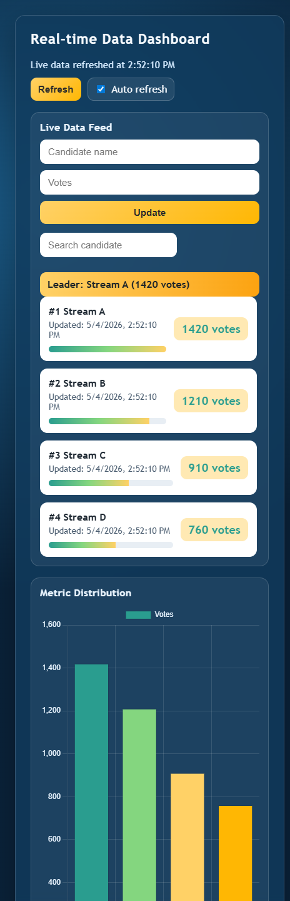
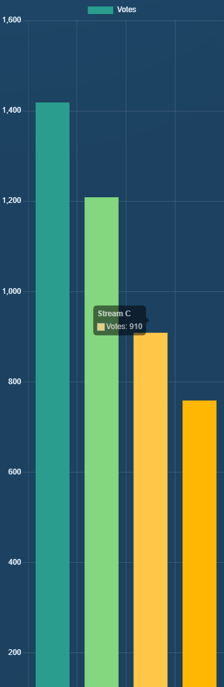

# Real-time Data Dashboard

A containerized backend dashboard built with Flask, PostgreSQL, Docker, and Docker Compose.

Handles real-time updates, user input, and database synchronization using containerized architecture.

## Tech Stack

- Flask API
- PostgreSQL
- Docker
- Docker Compose
- Chart.js (frontend visualization)

## Run Demo

```bash
docker-compose up --build
```

Open the dashboard at: http://localhost:5000/dashboard

## GitHub Topics

docker flask postgresql backend dashboard realtime

## API Endpoints

- `GET /health`
- `GET /db-test`
- `GET /api/results`
- `POST /api/results`

## 📸 Preview



